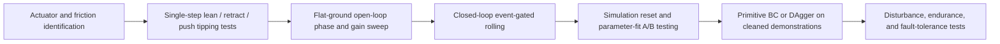

# Reliable Locomotion for Urchin v3

## Executive Summary

Urchin v3 already has the right *class* of locomotion primitive: the uploaded repo briefing describes a hand-engineered controller that combines a rear contact-gated push field with a top-front “lean” bulge, and that controller already produces repeatable flat-ground rolling at roughly 0.15–0.20 m/s over a 7.5 s episode. The important conclusion is that this is **not** a pure center-of-mass-shift robot. In the spherical-robot literature, the closest taxonomic match is a **hybrid of shell transformation and barycenter-offset locomotion**: some motion comes from moving mass forward, but much of the usable roll torque comes from **reshaping the support/contact geometry** so the robot tips forward instead of merely wobbling or self-righting. fileciteturn0file0 citeturn19view0turn19view1turn18view0

A quick magnitude check explains why. Using the briefing’s shell weight and panel masses gives a total mass of about 2.52 kg. If 4, 6, or 8 well-aligned 25 g panels each move forward by 50 mm, the whole-body COM moves by only about 2.0, 3.0, or 4.0 mm, respectively. That is enough to bias a marginal tip, but not enough to explain reliable rolling by itself. For Urchin, **rear-bottom extension, front-bottom unloading, and front-top lean must be coordinated as one coupled mechanism**. The most valuable controller change is therefore to make the current implicit dipole into an **explicit three-field gait** with separate gains and phase offsets for: front-top lean, rear-bottom push, and front-bottom retract. fileciteturn0file0 citeturn34calculator1turn34calculator2turn34calculator3turn35calculator0

The best near-term control strategy is a **hybrid controller**, not end-to-end RL. Keep the current RollingEngine as the locomotion backbone, add event-based gating from existing IMU and contact signals, and let learning adjust only a few low-dimensional meta-parameters or primitive selections. That recommendation is strongly aligned with successful approaches in spherical and tensegrity robots: symmetry reduction, graph search over target shapes, low-level PID to shape targets, imitation learning from expert nonlinear MPC, and sim-to-real system identification instead of unconstrained action-space exploration. fileciteturn0file0 citeturn11view0turn31search0turn26view1turn28view0turn9search0

The highest-priority experiments are not new policies. They are: first, actuator and friction identification; second, isolated quasi-static tipping tests that independently measure the value of each field; third, reset-hygiene tests in simulation. The briefing’s “E-series” evidence points to a stateful environment problem during arena-scale training, while entity["company","NVIDIA","gpu company"] Isaac Lab’s own reset guidance says articulation state should be explicitly rewritten and `reset()` called to clear internal buffers and caches. PhysX documentation also notes friction-memory behavior and solver choices that can affect low-speed rolling stability. Until that stack is clean, demonstration-driven training is the safer path than residual RL fine-tuning. fileciteturn0file0 citeturn12search0turn12search2turn12search6turn13search0turn13search5turn13search6

## Repo-Derived Baseline and Mechanics

The repo-specific findings below are anchored to the uploaded urchin_v3 briefing rather than direct in-session browsing of the private entity["company","GitHub","code hosting platform"] repository. According to that briefing, Urchin v3 is a spherical inner shell carrying 42 homogeneous radial voice-coil panels, each on a prismatic joint with 0–60 mm stroke, a 10 mm rest extension, about 60 N effort limit, 800 N/m spring stiffness, 1.0 N·s/m damping, and 25 g panel mass. The sim stack is Isaac Lab/PhysX at roughly 240 Hz physics and 60 Hz environment rate. The observation vector already includes all the signals needed for contact-aware control: body IMU, projected gravity, joint position and velocity, goal direction in body frame, and per-panel contact-force estimates. fileciteturn0file0

The current RollingEngine is already physically well-motivated. Its main ingredients are a **bipolar contact-zone dipole** that extends rear panels in contact while retracting front panels in contact, and a **top-front bulge** that shifts some mass toward the desired travel direction. The current steering fix—gating steering bias by body angular velocity—is especially important, because the briefing shows that “turn while stationary” created ambiguous data and broke behavior cloning. That is a strong sign that reliable locomotion depends on **state-dependent contact logic**, not just static shape templates. fileciteturn0file0

From the older and newer spherical-robot reviews, Urchin should be thought of as a robot that sits **between** shell-transformation and barycenter-offset designs. The reviews emphasize that pure barycenter-offset spheres are torque-limited because the COM cannot move outside the shell, while shell-transformation robots gain leverage by changing the body/contact geometry itself. That framing matches the briefing’s observation that many simpler push or wobble strategies fell into a stable forward-tilt “Weeble lock,” and that only the combined contact dipole plus top-front bulge broke the equilibrium. fileciteturn0file0 citeturn19view0turn19view1turn19view3

A useful practical interpretation is this: **Urchin is a contact-manager first and a COM-shifter second**. The top-front extension is best treated as a *bias* that chooses the direction of the next tip. The roll itself comes when rear-bottom panels increase backward reaction force while front-bottom panels remove forward support quickly enough that the support boundary moves behind the projected COM. That interpretation is consistent with the shell-transformation literature, tensegrity rolling papers, and pendulum-sphere work that repeatedly report friction, support geometry, and contact transitions as the real bottlenecks to reliable locomotion. citeturn33search0turn9search0turn7search0turn22search1

## Comparable Robots, Projects, and Papers

The recent systematic review of spherical rolling robots found that the design space is dominated by barycentric, pendulum-based, shell-transforming, and angular-momentum approaches, with control methods spanning PID, classical nonlinear control, and several learning-based methods. For Urchin v3, the most relevant comparables are not only “ball robots,” but also **shape-changing spheres**, **spherical tensegrities**, and **self-righting contact-switching platforms**. citeturn18view0turn18view1

image_group{"layout":"carousel","aspect_ratio":"16:9","query":["NASA SUPERball tensegrity robot","Mochibot 32-legged spherical robot","Mini Wheelbot reaction wheel robot","pendulum-driven spherical robot prototype"],"num_per_query":1}

| Title | Authors / source | Key mechanism | Relevance to Urchin v3 | Pros | Cons | Implementation note |
|---|---|---|---|---|---|---|
| Continuous Shape Changing Locomotion of 32-legged Spherical Robot | Nozaki, Kujirai, Niiyama, Kawahara, Yonezawa, Nakazawa. citeturn32search1turn32search0 | 32 telescopic radial legs create continuous contact-surface shifts rather than discrete tumbles. | This is one of the closest morphology analogs to Urchin: many radial actuators on a spherical body, locomotion from distributed shape change. | Strong intuition for continuous support migration; explicitly addresses smooth path tracking. | More “multi-leg sphere” than panel shell; larger contact discreteness than Urchin’s tiles. | Use it as the main inspiration for **continuous contact-surface transport** instead of pure impulse rolling. |
| Development of a deformation-driven rolling robot with a soft outer shell | Masuda, Ishikawa. citeturn33search0turn33search2 | Active shell deformation through a soft outer shell and prestressed wire drive. | Directly relevant to Urchin’s shell-transformation component. | Shows that shape change alone can drive rolling; emphasizes lightweight/tough structure. | Soft-shell mechanics differ from rigid inner shell + panels; fewer sensing/control details available. | Useful for testing whether **shape geometry** or **mass movement** dominates in Urchin. |
| Rolling Locomotion of Cable-Driven Soft Spherical Tensegrity Robots | Kim, Agogino, Agogino. citeturn9search0turn9search1 | Rolling through carefully chosen deformations; uses dynamic relaxation plus greedy and Monte Carlo search for good actuation strategies. | Very relevant because it treats rolling as a sequence of contact-state changes and targeted deformations. | Strong physical interpretation; simulation + hardware validation; scalable strategy search. | Tensegrity compliance is different from rigid panels. | Borrow the idea of **searching over low-dimensional shape transitions**, not raw 42-actuator commands. |
| System Design and Locomotion of SUPERball, an Untethered Tensegrity Robot | Sabelhaus et al.; entity["organization","NASA","space agency"] NTRS and paper. citeturn22search1turn22search0 | Distributed compliant rolling through cable actuation; low-level motor position control validated against sensors. | Relevant for distributed spherical rolling, sensorized actuation, and robustness. | Hardware-proven; strong emphasis on sensing, actuator characterization, and motion primitives. | Heavier compliance and distributed cables make control slower than Urchin’s voice-coils. | Use as a template for **instrumentation discipline** and motion-primitive validation. |
| Adaptive tensegrity locomotion with symmetry-reduced reinforcement learning | Surovik, Wang, Vespignani, Bruce, Bekris. citeturn31search0turn31search3 | Uses symmetry to reduce policy search space, enabling adaptive rolling and incline traversal. | Extremely relevant because Urchin already uses a 9-D SH basis for symmetry-aware actuation. | Strong argument for low-dimensional, symmetry-aware control. | RL is still sensitive to contact complexity and sim fidelity. | Continue exploiting symmetry; keep learning in the **reduced space of modes or primitives**. |
| Real2Sim2Real Transfer for Control of Cable-driven Robots via a Differentiable Physics Engine | Wang et al. citeturn26view0turn11view0 | System identification from offline measurements plus one random trajectory; non-zero contact gradients; gait-aware trajectory segmentation. | One of the most useful papers for Urchin’s sim/hardware alignment and contact-rich identification. | Practical pipeline; explicitly addresses contact parameters and sim2real gap. | Developed on a 3-bar tensegrity, not a panel sphere. | Copy the workflow: **measure what you can offline, fit friction/contact online, then train control on the fitted model**. |
| Morphology-Aware Graph Reinforcement Learning for Tensegrity Robot Locomotion | Zhang, Li, Tong, Huang. citeturn26view1 | GNN policy injects structural priors into SAC; validated on a physical tensegrity robot with sim-to-hardware transfer. | Relevant because Urchin’s panel graph can also be treated as a structured morphology instead of a flat vector. | Good evidence that morphology-aware inductive bias improves sample efficiency and transfer. | Preprint, not yet peer reviewed. | If learning resumes, use a **panel adjacency graph** or harmonic/graph hybrid policy instead of an MLP on concatenated observations alone. |
| Development and Control of a Real Spherical Robot | Schröder et al. citeturn7search0turn7search3 | Real pendulum-driven sphere with position and speed control; discusses friction and steering/longitudinal split. | Useful contrast: pure barycenter-offset control and practical friction issues in real hardware. | Real robot; clear treatment of friction and control decomposition. | Pendulum geometry is less similar to Urchin than shape-changing systems are. | Reinforces that **steering should be handled separately from forward drive**, especially at low speed. |
| The Mini Wheelbot and repo | Hose, Weisgerber, Trimpe; public repo. citeturn28view0turn15view0turn15view1 | Reaction-wheel unicycle with discrete contact switches, self-righting, Bayesian optimization, imitation learning from nonlinear MPC. | Not spherical, but highly relevant as a benchmark for learning on contact-switching unstable bodies. | Excellent exemplar of expert-controller + imitation-learning workflow; automatic resets for repetitive testing. | Dynamics differ from rolling shell deformation. | Copy the **expert-MPC/imitation-learning mindset**, not the exact mechanics. |
| 3D Mapping Sphere ROS2 repo | JMUWRobotics repository. citeturn14view0turn16view1turn16view3turn16view0 | Custom spherical robots with PID control, IMU/LiDAR integration, servo control workspace, and practical launch stack. | Valuable as an engineering reference for “what a practical spherical robot software stack looks like.” | Real repo; useful for ROS2, sensing, and hardware integration patterns. | Pendulum/actuated-sphere architecture differs from Urchin. | Good source for **telemetry organization, hardware interfaces, and practical fail-start/restart quirks**. |
| A Shape-Changing Wheeling and Jumping Robot Using Tensegrity Wheels and Bistable Mechanism | Spiegel, Sun, Zhao. citeturn23view0 | Variable-geometry tensegrity wheels change width/height and improve obstacle handling. | Relevant because Urchin’s panels also alter body geometry and obstacle interaction. | Strong evidence that controlled shape changes improve traversability and robustness. | Wheel geometry is not spherical shell deformation. | Use the paper’s lesson that **shape state should be selected based on terrain/task**, not held constant. |
| GoQBot or rolling soft robots | Lin, Leisk, Trimmer; Yang et al.; Li et al. citeturn5search1turn29search3turn30search0 | Ballistic or bistable rolling from rapid shape change and compliant structures. | Useful mainly for timing and energy insights: rapid, decisive transitions can outperform weak continuous pushes. | Good examples of fast rolling and bistable energy storage. | Soft material dynamics differ strongly from Urchin. | Inspiration for adding a **bounded snap-like unload/push phase** instead of only gentle sinusoidal pumping. |

## Control Strategies and Actuation Patterns

The literature and the repo history point to the same design rule: successful rolling controllers rarely command all actuators independently. They compress the control problem into a few **physically meaningful modes**, then use state feedback to decide *when* each mode should dominate. For Urchin, the right reduced basis is already visible in the current controller and SH action space: a forward lean mode, a rear support-push mode, a front support-removal mode, and a small recovery/exploration mode. fileciteturn0file0 citeturn9search0turn31search0turn26view1

```mermaid
flowchart LR
    A[IMU + projected gravity + joint states + contact forces + goal] --> B[Estimate down axis, travel axis, slip, stall, symmetry]
    B --> C[Build lean field]
    B --> D[Build rear push field]
    B --> E[Build front retract field]
    C --> F[Phase offsets + event gating]
    D --> F
    E --> F
    F --> G[Steering gate based on |omega|]
    G --> H[SH projection or direct panel targets]
    H --> I[LPF + actuator saturation + jerk limit]
    I --> J[Panel motion and ground contact]
    J --> A
```

That control flow is consistent with the briefing’s observation that arc primitives were physically ill-defined from rest, with the tensegrity literature’s use of symmetry reduction and target-shape graphs, and with Mini Wheelbot’s expert-controller-first learning pipeline. fileciteturn0file0 citeturn11view0turn31search0turn28view0

### Distilled strategies to try

| Strategy | Timing pattern | Feedback | Why it is promising | Starting range |
|---|---|---|---|---|
| Explicit lean–unload–push triplet | Front-top lean leads by a small phase, front-bottom retract is simultaneous or slightly early, rear-bottom push peaks last. | IMU projected gravity + contact forces. | Makes the current implicit physics explicit; easiest way to test whether front support removal is the missing lever. | Lean lead 0.05–0.17 cycle; retract lead 0–0.06 cycle; rear push duty 0.35–0.65. |
| Overlapping phasic gait | All three fields run continuously but with different envelopes. | Same as above plus angular velocity. | Better for steady rolling once motion starts; avoids stop-go wobble. | Phase velocity 0.4–2.5 Hz; overlap 20–60% of cycle. |
| Event-based phase reset | Advance phase when contact asymmetry or roll angle threshold is reached, not only by clock time. | Contact asymmetry, pitch/roll angle, angular velocity. | Robust to friction drift and underdamped oscillations; reduces sensitivity to absolute timing. | Reset when rear-load minus front-load crosses threshold or when forward roll angle increment exceeds setpoint. |
| Slip-aware amplitude scheduler | Reduce rear push and/or increase front retract when slip rises. | Slip estimator from \(R\omega-v\), contact force ratio. | Prevents big rear pushes from turning into energy waste. | Rear push scale multiplier 0.5–1.0 based on slip. |
| Primitive backbone with learned meta-parameters | Policy chooses style / primitive / gain set instead of raw actuation every step. | Goal heading, speed error, stall flag, terrain estimate. | Best match to repo evidence: the oracle works; huge direct exploration does not. | Learn 5–8 parameters per 0.25–0.5 s horizon. |
| Break-symmetry recovery reflex | When stalled in a symmetric or “puck” state, inject one asymmetric pulse. | Low progress, low \(|\omega|\), high symmetry metric. | Direct attack on the repo’s two main attractors: Weeble lock and puck shape. | 0.1–0.3 s asymmetric pulse with moderate front bias. |

### Open-loop and closed-loop recommendations

Open-loop work is still useful, but only as a **mapping tool**. Use it to chart where rolling exists in the low-dimensional parameter space, especially the ratio of rear push to front reach and the timing between top-front lean and front-bottom retract. That chart should become Urchin’s “locomotion atlas.” Once that atlas exists, close the loop around contact and angular velocity so the controller can phase-reset when the actual support transition lags or leads the nominal one. citeturn9search0turn11view0turn31search0

Closed-loop steering should remain momentum-gated just as the briefing now does. More broadly, **turning should be treated as a modulation of a moving gait, not as a shape at rest**. The pendulum-sphere literature and the briefing’s own arc-from-rest failure both support that separation. fileciteturn0file0 citeturn7search0turn7search6

## Experimental Plan

The best experimental sequence is to move from *physics identification* to *single-step tipping* to *steady rolling*, and only then to learning. That order matches the failure evidence in the repo and the best-practice patterns in tensegrity and sim-to-real rolling papers. fileciteturn0file0 citeturn26view0turn22search1turn9search0

| Priority | Test | Variables | Metrics | Instrumentation | Expected outcome |
|---|---|---|---|---|---|
| Highest | Actuator step and bandwidth characterization | Single panel pulses; paired panel pulses; representative 3-field commands. | Rise time, overshoot, settling time, phase lag, current draw. | High-speed video or motion capture, encoder/joint logs, bus current sensing. | Confirms safe phase-velocity range and whether underdamping needs more filtering. |
| Highest | Static friction and rolling-resistance map | Surface material, preload, panel rest extension, push amplitude. | Slip onset, coast-down distance, effective \(\mu\), rolling resistance. | Incline rig, drag test, force gauge, video. | Gives real friction envelope for both sim and controller scheduling. |
| Highest | Quasi-static tipping decomposition | Lean only; retract only; push only; lean+retract; retract+push; lean+retract+push. | Tip margin, onset angle, contact-set change, net forward rotation. | Overhead camera, IMU, contact logs, optional support-force plate or pressure film. | Reveals which field actually creates usable forward tip. |
| High | Open-loop phase sweep | Rear push amp, front reach amp, front retract amp, phase offsets, duty, phase velocity. | Net displacement/cycle, success rate, slip ratio, bounce count, energy/meter. | Same as above plus current logging. | Produces locomotion atlas and identifies stable basins. |
| High | Event-gated closed-loop controller | Contact thresholds, stall logic, slip scheduler, phase-reset rules. | Success rate, repeatability, variance across friction changes. | IMU, contact sensors, pose tracking. | Should outperform fixed-phase gait under disturbance and friction variation. |
| High | Simulation reset A/B test | Fresh process vs fresh articulation view vs reused env; strong friction on/off; solver configs. | Deterministic reward drift, trajectory divergence, contact-state divergence. | Automated scripted evals with identical seeds. | Confirms whether the E-series collapse is simulator-state contamination. |
| Medium | Primitive BC / DAgger on cleaned dataset | Skill label, style label, horizon length, meta-parameter outputs. | Goal reach, primitive separation, style separation, OOD recovery. | Existing dataset machinery + audit scripts. | Most likely path to robust arena navigation before RL fine-tuning is revisited. |
| Medium | Disturbance and durability | Small pushes, friction variation, disabled panels, repeated episodes. | Recovery time, path error, actuator temperature/current drift, fault tolerance. | Robot pose tracking, thermal/current logging. | Determines whether controller is “reliable,” not merely “works once.” |



For this plan, the most useful scalar metrics are: net displacement per cycle, success probability to a goal, slip ratio, cost of transport, front versus rear support load difference, and time spent in the “puck” basin. Do **not** rely on episode reward alone; the briefing shows reward and deterministic locomotion quality can decouple badly. fileciteturn0file0

## Simulation, Models, and Implementation Guidance

### Simple models and equations

A reduced model that is good enough to be useful should include both mass shift and support migration. A practical Urchin model is:

\[
M = m_s + \sum_{i=1}^{42} m_i
\]

\[
\mathbf r_{\mathrm{COM}}
=
\frac{
m_s\mathbf r_s + \sum_{i=1}^{42} m_i(\mathbf r_{i,0} + q_i \hat{\mathbf n}_i)
}{M}
\]

where \(q_i\) is the panel extension along its radial axis \(\hat{\mathbf n}_i\). The forward COM bias is then

\[
d_f = \mathbf r_{\mathrm{COM}} \cdot \hat{\mathbf f}
\]

with \(\hat{\mathbf f}\) the current travel axis in body frame.

To capture the effect of front-bottom retract and rear-bottom push, define a support-boundary estimate in the forward tangent direction:

\[
s_f
=
\frac{\sum_i w_i x_i}{\sum_i w_i + \epsilon},
\qquad
w_i = \max(F_{n,i},0)\,\chi_i
\]

where \(x_i\) is the forward coordinate of contact \(i\), \(F_{n,i}\) is normal force, and \(\chi_i\) selects the active support contacts. The **tipping margin** is

\[
m_{\mathrm{tip}} = d_f - s_f
\]

and forward rolling onset is expected when \(m_{\mathrm{tip}} > 0\) for long enough to overcome rolling resistance. The forward gravity torque in a quasi-static reduction is

\[
\tau_f \approx M g\, m_{\mathrm{tip}} - \tau_{rr}
\]

This is the simplest model that respects the repo evidence that COM bias alone is not enough.

Two additional diagnostics are worth tracking in every run:

\[
s
=
\frac{R\omega_{\mathrm{roll}} - v}{\max(|R\omega_{\mathrm{roll}}|, |v|, \epsilon)}
\]

for slip ratio, and

\[
\mathrm{COT}=\frac{E_{\mathrm{elec}}}{M g L}
\]

for energy efficiency.

Because Urchin already uses a 9-D spherical-harmonic basis, you can also define a **shape health** metric directly in harmonic coordinates. Let \(E_1\) be dipole energy and \(E_2\) quadrupole energy. Then a practical puck diagnostic is the dominance of the “equator-vs-poles” quadrupole mode:

\[
P = \frac{|a_{20}|}{E_2 + \epsilon}
\]

Large \(P\) with low progress and low angular velocity is a good puck-attractor detector. This is cleaner than a hand-crafted raw-panel asphericity penalty because it uses the geometry-aware basis the controller already has. fileciteturn0file0

### Suggested analysis and simulation methods

Use three simulators/models in parallel. First, a **planar reduced-order model** with only forward tip, support migration, and simple friction. Second, the full Isaac/PhysX model with the improved three-field controller. Third, one independent check in a second engine or simpler rigid-body framework. The point is not perfect realism; it is to separate controller fragility from contact-model fragility. The NTRT ecosystem, R2S2R work, and the spherical-robot literature all point to the value of simulator-assisted search, but they also show that contact handling and parameter identification dominate transfer quality. citeturn15view2turn15view4turn26view0turn18view0

For the full sim, use a **system-identification loop** instead of blind curriculum tuning. Measure mass, dimensions, actuator stiffness, and a few force/displacement curves offline; then fit the hard-to-measure parameters such as effective friction, actuator speed limits, and contact offsets using one or a few traceable trajectories. That is the core lesson of the Real2Sim2Real pipeline. citeturn26view0turn11view0

For contact settings, keep a close eye on PhysX friction behavior. PhysX documents that patch friction is the default, that TGS handles combined friction impulses more stably than PGS in some transitions between static and dynamic friction, and that “strong friction” explicitly remembers friction error between steps. Those facts matter for a slow rolling robot with repeated near-static contacts, and they make reset hygiene and solver A/B testing especially important given the briefing’s persistent-state suspicion. citeturn13search0turn13search5turn13search6

For reset handling, follow Isaac Lab’s documented reset sequence literally: write root pose, write root velocity, write joint state, then call `reset()` so internal buffers and caches are cleared. The briefing’s E-series evidence makes that guidance operationally important, not cosmetic. fileciteturn0file0 citeturn12search0turn12search2turn12search6

### Recommended pseudocode

```python
# Improved Urchin rolling controller
def rolling_step(obs, cfg, state, panel_axes, panel_forward_coords):
    # body-frame basis
    down_b = normalize(-obs.projected_gravity)
    travel_b = rotate_about_axis(
        normalize(goal_dir_body(obs)),
        down_b,
        cfg.steering_bias * min(norm(obs.ang_vel) / cfg.steer_fullspeed, 1.0)
    )

    # alignments
    d = panel_axes @ down_b          # "how downward"
    f = panel_axes @ travel_b        # "how forward"

    # contact / geometry fields
    support = sigmoid(cfg.support_width * (d - cfg.support_gate))
    rear    = sigmoid(-cfg.rear_width * (f - cfg.support_bias))
    front   = sigmoid( cfg.front_width * (f - cfg.front_bias))

    lean_top   = sigmoid(-cfg.top_width * (d + cfg.top_gate))
    lean_front = sigmoid( cfg.lean_width * (f - cfg.lean_gate))
    lean_field = lean_top * lean_front

    rear_push_field    = support * rear
    front_retract_field = support * front

    # phase envelopes
    phi = state.phase
    lean_env    = cosine_window(phi + cfg.lean_phase,   cfg.lean_duty)
    retract_env = cosine_window(phi + cfg.retract_phase, cfg.retract_duty)
    push_env    = cosine_window(phi + cfg.push_phase,   cfg.push_duty)

    raw = (
        cfg.front_reach_amp   * lean_env    * lean_field
        - cfg.front_retract_amp * retract_env * front_retract_field
        + cfg.rear_push_amp   * push_env    * rear_push_field
        + cfg.breathing_gain  * math.sin(phi + cfg.breath_phase)
    )

    # stall / puck recovery
    if is_stalled(obs, state):
        raw += cfg.break_sym_amp * break_symmetry_vector(panel_axes, travel_b, down_b)

    raw = clamp(raw, -1.0, 1.0)
    sh_cmd = project_to_sh9(raw)                # or keep direct 42-D command
    sh_cmd = low_pass(sh_cmd, state.prev_cmd, alpha=cfg.target_lpf_alpha)

    # event-based phase reset
    if should_phase_reset(obs, state):
        state.phase = wrap_to_2pi(state.phase + cfg.phase_jump)
    else:
        state.phase = wrap_to_2pi(state.phase + 2 * math.pi * cfg.phase_velocity_hz * cfg.dt)

    return sh_cmd, state
```

The most important code-level change here is not sophistication. It is the introduction of an **explicit `front_retract_amp` and separate phase slots** for lean, retract, and push. That gives you a direct way to test the physical hypothesis the repo evidence already suggests. fileciteturn0file0

```python
# Isaac-Lab-style deterministic reset hygiene before eval
def hard_reset(robot, sim, root_pose_w, joint_pos_0):
    joint_vel_0 = torch.zeros_like(joint_pos_0)
    root_vel_0  = torch.zeros((root_pose_w.shape[0], 6), device=root_pose_w.device)

    robot.write_root_link_pose_to_sim(root_pose_w)
    robot.write_root_com_velocity_to_sim(root_vel_0)
    robot.write_joint_state_to_sim(joint_pos_0, joint_vel_0)
    robot.reset()   # reset internal buffers / caches

    # allow contacts to settle from the freshly written state
    for _ in range(4):
        sim.step()
```

If the collapse persists, add two stronger A/B conditions: recreate the articulation view at every deterministic-eval boundary, and run fresh-process evals. That will tell you whether the issue is controller drift, environment drift, or both. citeturn12search0turn12search2turn12search6turn13search5

### Parameter ranges to try

| Parameter | Current repo cue | Suggested sweep |
|---|---:|---:|
| `rear_push_amp` | existing knob | 0.35–0.90 |
| `front_reach_amp` | existing knob | 0.15–0.60 |
| `front_retract_amp` | **new knob** | 0.10–0.80 |
| `support_width` | ~6.0 in briefing | 4.0–10.0 |
| `support_bias` | existing knob | -0.15 to +0.10 |
| `phase_velocity_hz` | existing knob | 0.4–2.5 |
| `push_duty` | current `duty_cycle` | 0.35–0.65 for pulsed, 1.0 for continuous baseline |
| `lean_phase` relative to push | not explicit now | +0.05 to +0.17 cycles lead |
| `retract_phase` relative to push | not explicit now | 0 to +0.06 cycles lead |
| `target_lpf_alpha` | 0.30 in briefing | 0.20–0.45 |
| steering full-gain threshold | 0.8 rad/s in briefing | 0.5–1.0 rad/s |
| stall detector window | not formalized | 0.4–0.8 s low-progress / low-\(|\omega|\) window |

These are **starting sweeps**, not “one true setting.” Their purpose is to map the locomotion atlas quickly and to respect the underdamped panel dynamics the briefing already reports. fileciteturn0file0

## Risks, Failure Modes, and Tuning Checklist

The biggest mechanical failure modes are the ones already visible in the repo history: Weeble lock, puck attractor, slip without net roll, and underdamped bounce from overly fast phasing. The biggest algorithmic risks are direct high-dimensional exploration, ambiguous demonstrations such as arc-from-rest, and trusting episode reward when deterministic locomotion quality is degrading. The biggest simulation risks are incomplete resets, friction-memory artifacts, and contact-parameter drift hidden by curriculum or long training runs. fileciteturn0file0 citeturn13search0turn13search5turn12search0

### Tuning checklist

- Verify that rear support load actually increases during the push window, and that front support load falls during the retract window. If not, no amount of reward shaping will fix the gait.
- Keep steering gated by motion. If \(|\omega|\) is near zero, steering should be near zero.
- Log the three mode energies separately: lean, retract, push. Successful runs should show consistent ordering, not random overlap.
- Track the SH puck ratio \(P\). If \(P\) is high while progress and \(|\omega|\) are low, fire a break-symmetry recovery pulse.
- If slip ratio rises, reduce rear push before increasing lean. More rear force on a slipping surface usually wastes energy.
- If the robot bounces or body angular velocity oscillates, reduce phase velocity or increase command filtering before changing amplitudes.
- Compare at least three reset modes during evaluation: reused environment, hard articulation reset, and fresh-process eval.
- Keep a separate “physics regression suite” from the learning suite: actuator steps, one-cycle gaits, quasi-static tipping, and coast-down tests.
- When learning resumes, have the policy output **primitive or controller parameters**, not raw per-step SH commands, unless the simulator-state issue is resolved first.
- Prefer BC or DAgger on cleaned demonstrations over PPO fine-tuning until deterministic evals stay stable under frozen weights.
- Add one fault-tolerance test early: disable one rear-favored actuator and verify the controller can re-route support asymmetry.
- Instrument energy early. Use cost of transport and peak current, not just distance traveled, so the tuning process does not silently choose damaging or inefficient gaits.

## Open Questions and Limitations

Some parts of this report are necessarily bounded by what was available in-session. The repo-specific conclusions come from the uploaded urchin_v3 briefing rather than direct branch-level browsing of the private repository, so file-path references and controller behavior are only as exact as that briefing. fileciteturn0file0

A few relevant recent sources are preprints or metadata pages rather than finalized journal versions, especially the morphology-aware GNN locomotion paper and some GitHub-linked robot projects. I included them because they are mechanistically relevant, but I weighted the core recommendations toward stronger sources: the Urchin briefing, the spherical-robot reviews, Kim et al. on rolling tensegrities, the SUPERball hardware paper, the R2S2R paper, PhysX documentation, and Isaac Lab documentation. citeturn26view1turn18view0turn9search0turn22search1turn26view0turn13search6turn12search0

The largest remaining unknown is still the same one identified in the briefing: whether arena-scale collapse is fundamentally a simulator-state/reset issue, a curriculum issue, or an interaction between the two. Until that is resolved, the safest engineering posture is to treat RL fine-tuning as **secondary** and to focus on controller decomposition, system identification, reset hygiene, and demonstration-driven improvement first. fileciteturn0file0